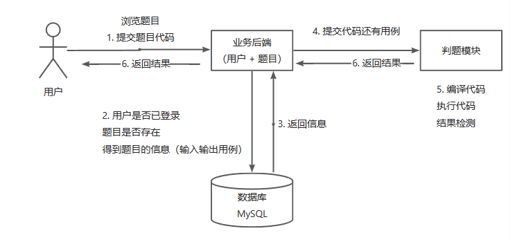
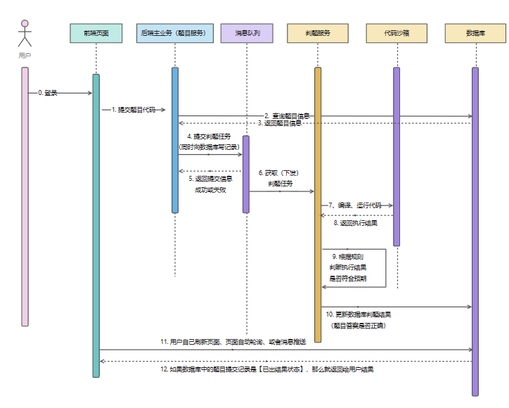

# Online Judge

## 项目介绍
OJ = Online Judge 在线判题评测系统
用户可以选择题目，在线做题，编写代码并且提交代码；系统会对用户提交的代码，根据我们出题人设置的答案，来判断用户的提交结果是否正确。
ACM（程序设计竞赛），也是需要依赖判题系统来检测参赛者的答案是否合理
OJ 系统最大的难点在于 判题系统
用于在线评测编程题目代码的系统，能够根据用户提交的代码、出题人预先设置的题目输入和输出用例，进行编译代码、运行代码、判断代码运行结果是否正确。
判题系统作为一个开放 API 提供给大家，便于开发者开发自己的 OJ 系统。

普通测评：管理员设置题目的输入和输出用例，比如我输入 1，你要输出 2 才是正确的；交给判题机去执行用户的代码，给用户的代码喂输入用例，比如
1，看用户程序的执行结果是否和标准答案的输出一致。
（比对用例文件）

特殊测评（SPJ）：管理员设置题目的输入和输出，比如我输入 1，用户的答案只要是 > 0 或 < 2
都是正确的；特判程序，不是通过对比用例文件是否一致这种死板的程序来检验，而是要专门根据这道题目写一个特殊的判断程序，程序接收题目的输入（1）、标准输出用例（2）、用户的结果（1.5）
，特判程序根据这些值来比较是否正确。

交互测评：让用户输入一个例子，就给一个输出结果，交互比较灵活，没办法通过简单的、死板的输入输出文件来搞定

不能让用户随便引入包、随便遍历、暴力破解，需要使用正确的算法。 => 安全性
判题过程是异步的 => 异步化
提交之后，会生成一个提交记录，有运行的结果以及运行信息（时间限制、内存限制）

## 项目流程
1. 项目介绍、项目调研、需求分析
2. 核心业务流程
3. 项目要做的功能（功能模块）
4. 技术选型（技术预研）
5. 项目初始化
6. 项目开发
7. 测试
8. 优化
9. 代码提交、代码审核
10. 产品验收
11. 上线

## 现有系统调研
1. https://github.com/HimitZH/HOJ （适合学习）
2. https://github.com/QingdaoU/OnlineJudge （python，不好学，很成熟）
3. https://github.com/hzxie/voj （星星没那么多，没那么成熟，但相对好学）
4. https://github.com/vfleaking/uoj （php 实现的）
5. https://github.com/zhblue/hustoj （成熟，但是 php）
6. https://github.com/hydro-dev/Hydro （功能强大，Node.js 实现）

## 核心业务流程



## 功能模块
1. 题目模块
    - 创建题目（管理员）
    - 删除题目（管理员）
    - 修改题目（管理员）
    - 搜索题目（用户）
    - 在线做题
    - 提交题目代码
2. 用户模块
    - 注册
    - 登录
3. 判题模块
    - 提交判题（结果是否正确与错误）
    - 错误处理（内存溢出、安全性、超时）
    - 自主实现 代码沙箱（安全沙箱）
    - 开放接口（提供一个独立的新服务）

## 项目扩展
1. 支持多种编程语言
2. Remote Judge
3. 完善的评测功能：普通测评、特殊测评、交互测评、在线自测、子任务分组评测、文件IO
4. 统计分析用户判题记录
5. 权限校验

## 技术选型
- 前端：Vue3、Arco Design 组件库、自创项目模板、在线代码编辑器、在线文档浏览
- 后端：Springboot 2.7、Mysql、Redis、腾讯云COS对象存储、Java 进程控制、Java 安全管理器、部分 JVM 知识点、虚拟机（云服务器）、Docker（代码沙箱实现）、Spring Cloud 微服务 、消息队列、多种设计模式

## 数据库设计
### 1. t_user 用户表
账号、加密后的密码、昵称、身份、邮箱、手机号、头像、用户简介
```mysql
-- ----------------------------
-- Table structure for t_user
-- ----------------------------
DROP TABLE IF EXISTS `t_user`;
CREATE TABLE `t_user`  (
  `id` bigint NOT NULL AUTO_INCREMENT COMMENT '主键，自动递增',
  `user_account` varchar(32) CHARACTER SET utf8mb4 COLLATE utf8mb4_unicode_ci NOT NULL COMMENT '用户账号，唯一',
  `user_password` varchar(64) CHARACTER SET utf8mb4 COLLATE utf8mb4_unicode_ci NOT NULL COMMENT '用户密码，使用SHA256加密',
  `user_role` varchar(32) CHARACTER SET utf8mb4 COLLATE utf8mb4_unicode_ci NOT NULL DEFAULT 'user' COMMENT '用户身份：ban/user/admin',
  `user_avatar` varchar(1024) CHARACTER SET utf8mb4 COLLATE utf8mb4_unicode_ci NULL DEFAULT NULL COMMENT '用户头像',
  `user_profile` text CHARACTER SET utf8mb4 COLLATE utf8mb4_unicode_ci NULL COMMENT '用户简介',
  `username` varchar(32) CHARACTER SET utf8mb4 COLLATE utf8mb4_unicode_ci NOT NULL COMMENT '用户昵称',
  `email` varchar(128) CHARACTER SET utf8mb4 COLLATE utf8mb4_unicode_ci NOT NULL COMMENT '用户邮箱，唯一',
  `phone` varchar(128) CHARACTER SET utf8mb4 COLLATE utf8mb4_unicode_ci NULL DEFAULT NULL COMMENT '用户手机号，唯一',
  `is_deleted` tinyint NOT NULL DEFAULT 0 COMMENT '是否逻辑删除',
  `create_time` datetime NOT NULL DEFAULT CURRENT_TIMESTAMP COMMENT '创建时间',
  `update_time` datetime NOT NULL DEFAULT CURRENT_TIMESTAMP ON UPDATE CURRENT_TIMESTAMP COMMENT '修改时间',
  PRIMARY KEY (`id`) USING BTREE,
  INDEX `idx_id`(`id` ASC) USING BTREE
) ENGINE = InnoDB CHARACTER SET = utf8mb4 COLLATE = utf8mb4_unicode_ci COMMENT = '用户表' ROW_FORMAT = Dynamic;
```

### 2. t_question 题目表
Judge Config 示例：
```json
{
   "timeLimit": 1000, // 单位是MS
   "memoryLimit": 512, // 单位是KB
   "stackLimit": 50,
   "judgeType": "判题类型"
}
```
判题类型枚举：
- Regular 普通测评
- Special 特殊测评
- Interactive 交互测评
- Self 在线自测
- Subtask 子任务分组评测
- File 文件IO

1. 普通测评（Regular Testing）
   - 普通测评是最基本的测评方式。
   - 在这种模式下，评测系统会针对提交的程序使用一系列预定义的输入数据运行程序，并将程序的输出与预期的输出进行比较。
   - 如果程序的输出与预期输出一致，并且在规定的时间和内存限制内，程序就被认为是正确的。
2. 特殊测评（Special Judging）
   - 特殊测评用于那些标准的输出比较不足以判断程序正确性的情况。
   - 在这种模式下，评测系统会使用一个特殊的评测程序（通常由题目出题者编写），这个程序会根据提交的程序输出来决定其正确性。
   - 特殊测评常用于解决方案有多种可能输出的题目。
3. 交互测评（Interactive Testing）
   - 交互测评用于那些需要程序与评测系统交互的题目。
   - 在这种模式下，提交的程序需要与评测系统的一个交互程序进行通信（例如，读取交互程序的提示并做出响应）。
   - 交互测评常用于那些需要动态输入或程序行为依赖于前一个输出的题目。
4. 在线自测（Online Self-testing）
   - 在线自测允许用户使用自定义的输入数据测试他们的程序。
   - 用户可以提供特定的输入数据，评测系统将会以这些数据作为输入来运行程序，并显示输出。
   - 这种方式有助于用户调试和理解他们的程序行为。
5. 子任务分组评测（Subtask Group Testing）
   - 在子任务分组评测中，题目被分成多个子任务，每个子任务有一组测试数据。
   - 这些子任务通常根据问题的不同方面或难度分级。
   - 用户提交的解决方案需要通过所有子任务中的测试数据，才能获得该子任务的分数。
6. 文件IO（File Input/Output）
   - 文件IO指的是程序通过读取文件来获取输入数据，并将输出写入到文件的评测方式。
   - 与标准输入输出（从控制台读取输入和输出）不同，文件IO要求程序从特定的输入文件读取数据，并将结果写入到特定的输出文件。
   - 这种方式常用于处理大量数据或在特定环境下的评测。

Judge Case 示例：
```json
[
   {
      "input": "1 2",
      "output": "3 4"
   },
   {
      "input": "1 3",
      "output": "2 4"
   },
]
```

存 json 的好处：便于扩展，只需要改变对象内部的字段，而不用修改数据库表

存 json 的前提：
1. 你不需要根据某个字段去倒查这条数据
2. 你的字段含义相关，属于同一类的值
3. 你的字段存储空间占用不能太大

```mysql
-- ----------------------------
-- Table structure for t_question
-- ----------------------------
DROP TABLE IF EXISTS `t_question`;
CREATE TABLE `t_question`  (
  `id` bigint NOT NULL AUTO_INCREMENT COMMENT '主键，自动递增',
  `title` varchar(512) CHARACTER SET utf8mb4 COLLATE utf8mb4_unicode_ci NOT NULL COMMENT '标题，唯一',
  `content` text CHARACTER SET utf8mb4 COLLATE utf8mb4_unicode_ci NOT NULL COMMENT '内容，包含题目详细说明，输入输出格式等信息',
  `question_level` varchar(32) CHARACTER SET utf8mb4 COLLATE utf8mb4_unicode_ci NULL DEFAULT NULL COMMENT '难度（easy/normal/hard等）',
  `tags` varchar(1024) CHARACTER SET utf8mb4 COLLATE utf8mb4_unicode_ci NULL DEFAULT NULL COMMENT '标签列表（json数组）',
  `answer` text CHARACTER SET utf8mb4 COLLATE utf8mb4_unicode_ci NULL COMMENT '标准答案',
  `submit_num` int NOT NULL DEFAULT 0 COMMENT '提交数',
  `accepted_num` int NOT NULL DEFAULT 0 COMMENT '通过数',
  `judge_config` text CHARACTER SET utf8mb4 COLLATE utf8mb4_unicode_ci NOT NULL COMMENT '判题配置（json对象，存储timeLimit、memoryLimit、stackLimit、判题类型judgeType等）',
  `judge_cases` text CHARACTER SET utf8mb4 COLLATE utf8mb4_unicode_ci NOT NULL COMMENT '判题用例（json数组，每一个元素中包含一对输入用例和输出用例）',
  `thumb_num` int NOT NULL DEFAULT 0 COMMENT '点赞数',
  `favour_num` int NOT NULL DEFAULT 0 COMMENT '收藏数',
  `user_id` bigint NOT NULL COMMENT '创建用户id',
  `is_deleted` tinyint NOT NULL DEFAULT 0 COMMENT '是否逻辑删除',
  `create_time` datetime NOT NULL DEFAULT CURRENT_TIMESTAMP COMMENT '创建时间',
  `update_time` datetime NOT NULL DEFAULT CURRENT_TIMESTAMP ON UPDATE CURRENT_TIMESTAMP COMMENT '更新时间',
  PRIMARY KEY (`id`) USING BTREE,
  INDEX `idx_id`(`id` ASC) USING BTREE,
  INDEX `idx_user_id`(`user_id` ASC) USING BTREE
) ENGINE = InnoDB CHARACTER SET = utf8mb4 COLLATE = utf8mb4_unicode_ci COMMENT = '题目表' ROW_FORMAT = Dynamic;
```

### 3. 提交表
Judge Info 示例：
```json
{
   "message": "程序执行信息",
   "time": 1000, // 单位是MS
   "memory": 1000, // 单位是KB
   "code length": 100 // 单位是B
}
```
判题信息枚举值：
- Accepted 答案正确
- Wrong Answer 答案错误
- Compile Error 编译错误
- Memory Limit Exceeded 内存超限
- Time Limit Exceeded 时间超限
- Presentation Error 格式错误（"Presentation Error"（PE）通常指的是你的程序虽然得出了正确的答案，但输出格式与题目要求的格式不完全一致。例如空格个数不一致、精度不一致等）
- Output Limit Exceeded 输出超限
- Waiting 等待中
- Dangerous Operation 危险操作
- Runtime Error 运行错误
- System Error 系统错误（做系统人的问题）
```mysql
-- ----------------------------
-- Table structure for t_submit
-- ----------------------------
DROP TABLE IF EXISTS `t_submit`;
CREATE TABLE `t_submit`  (
  `id` bigint NOT NULL AUTO_INCREMENT COMMENT '主键，自动递增',
  `submit_language` varchar(64) CHARACTER SET utf8mb4 COLLATE utf8mb4_unicode_ci NOT NULL COMMENT '编程语言',
  `code` text CHARACTER SET utf8mb4 COLLATE utf8mb4_unicode_ci NOT NULL COMMENT '用户代码',
  `judge_info` text CHARACTER SET utf8mb4 COLLATE utf8mb4_unicode_ci NULL COMMENT '判题信息（json对象，存储判题机返回的信息、判题耗时、判题所占空间等）',
  `submit_status` int NOT NULL DEFAULT 0 COMMENT '判题状态（0 - 待判题、1 - 判题中、2 - 成功、3 - 失败）',
  `question_id` bigint NOT NULL COMMENT '题目id',
  `user_id` bigint NOT NULL COMMENT '提交用户id',
  `is_deleted` tinyint NOT NULL DEFAULT 0 COMMENT '是否逻辑删除',
  `create_time` datetime NOT NULL DEFAULT CURRENT_TIMESTAMP COMMENT '创建时间',
  `update_time` datetime NOT NULL DEFAULT CURRENT_TIMESTAMP ON UPDATE CURRENT_TIMESTAMP COMMENT '更新时间',
  PRIMARY KEY (`id`) USING BTREE,
  INDEX `idx_id`(`id` ASC) USING BTREE,
  INDEX `idx_question_id`(`question_id` ASC) USING BTREE,
  INDEX `idx_user_id`(`user_id` ASC) USING BTREE
) ENGINE = InnoDB CHARACTER SET = utf8mb4 COLLATE = utf8mb4_unicode_ci COMMENT = '题目提交表' ROW_FORMAT = Dynamic;
```

## 核心模块

### 用户注册 ✔
1. 用户注册时须提供账号、密码、确认密码、有效邮箱地址以及邮箱验证码 ✔
2. 账号长度为6~12位，只能使用大写字母、小写字母、阿拉伯数字和下划线_，账号应不与数据库中的现有账号重复，账号不提供修改 ✔
3. 密码长度为6~16位，只能使用大写字母、小写字母、阿拉伯数字以及英文输入法下的!@#$%^&*符号，密码使用SHA256算法在后端加密 ✔
4. 确认密码须保持与密码一致 ✔
5. 邮箱地址须使用正则表达式校验，并在注册时通过邮箱验证码验证，用于后续的登录、修改密码、接收通知、修改邮箱等操作，邮箱地址应不与数据库中的邮箱地址重复 ✔
6. 注册成功后的用户昵称与用户账号保持一致，用户昵称可以通过其他途径修改 ✔
7. 注册成功跳转到登录页 ✔

### 用户登录 ✔
1. 用户登录可选择账号密码登录或者邮箱验证码登录 ✔
2. 账号密码登录需提供账号和密码，校验逻辑同用户注册 ✔
3. 邮箱验证码登录需提供邮箱地址和验证码，校验逻辑同用户注册 ✔
4. 登录成功后记录用户登录态，保存用户信息 ✔
5. 登录成功跳转到主页 ✔

## 功能拓展/优化
1. 替换前端Md文档编辑器的语言为简体中文，修复代码块或注释等不能很好渲染的bug；
2. 前端登录页面支持邮箱验证码登录；
3. 前端创建题目时的表单验证；
4. 后端Submit相关的接口；
